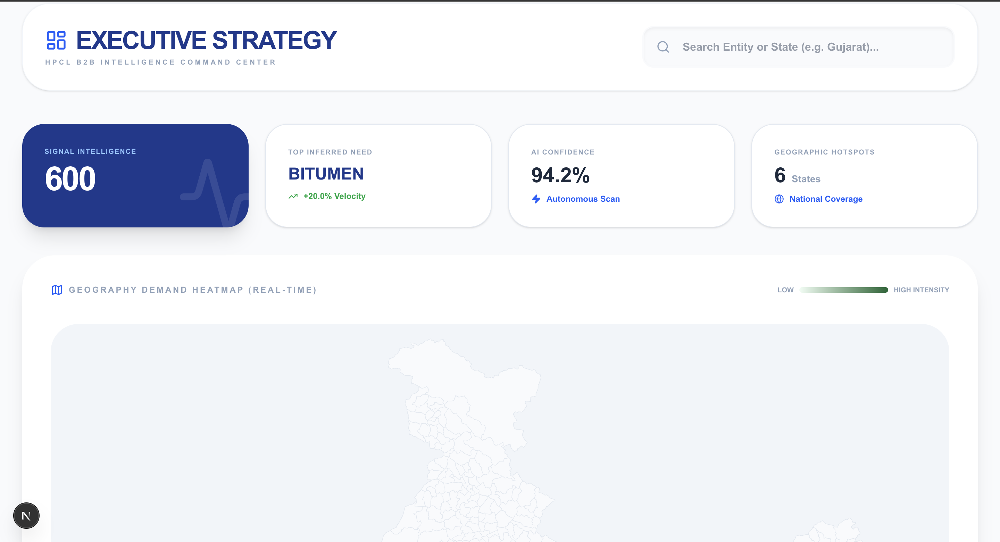
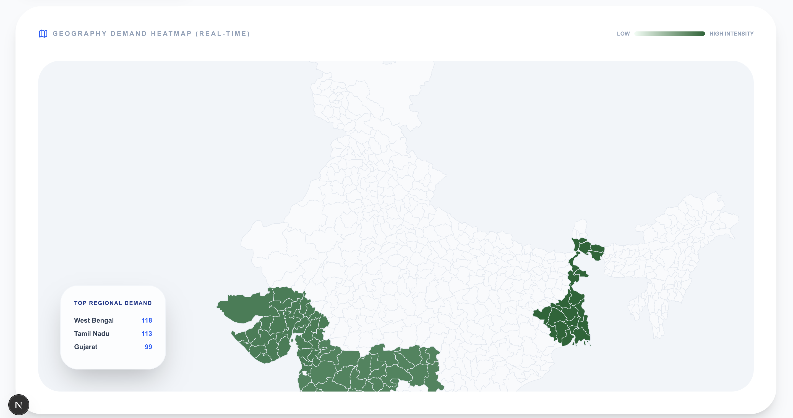
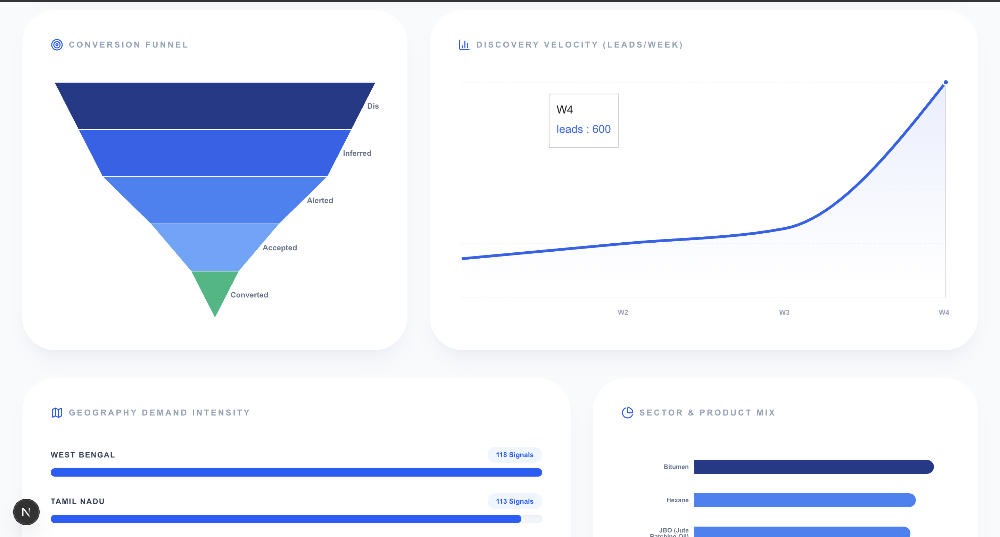
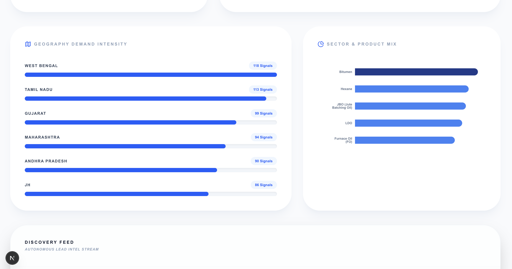
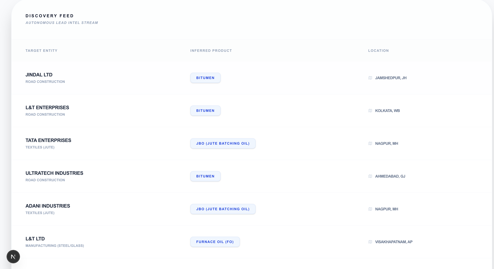

# 🛰️ HPCL Sentinel: Autonomous B2B Lead Intelligence
**🥈 2nd Place Winner @ IIT Roorkee PRODUCTATHON 2026**

   

> **An autonomous "Command Center" that harvests web signals, infers industrial demand, and triggers real-time sales action for HPCL.**

---

## 📺 Project Overview
HPCL Sentinel solves the "Information Gap" in B2B sales. Instead of sales officers manually searching for leads, our system acts as a 24/7 digital scout—identifying new factories, infrastructure projects, and tenders the moment they appear online.

*Figure 1: The Executive Strategy Dashboard featuring the National Demand Heatmap.*

---

## 🚀 Core Features

### 1. Geospatial Demand Intelligence
We visualize raw industrial signals across 36 States/UTs. This allows HPCL management to see **"Signal Velocity"**—identifying exactly where demand for Bitumen or Furnace Oil is spiking in real-time.

*Figure 2: Real-time Geographic Hotspots and Signal Intelligence tracking.*

### 2. AI-Driven Product Inference
Our "Sentinel" engine doesn't just find text; it understands it. Using NLP-based reasoning, it detects cues like *"Boiler installation"* and automatically recommends **Furnace Oil** with a **94.2% AI confidence score**.

*Figure 3: High-confidence AI recommendations and "Next Best Action" for Sales Officers.*

### 3. Real-Time WhatsApp "Pulse" Alerts
When a high-priority lead is discovered, the system bypasses slow emails and sends a direct **WhatsApp Pulse** to the relevant field officer via Twilio, ensuring 0-minute response time.

*Figure 4: Automated Mobile Alerts sent to field officers with direct Lead Dossier links.*

### 4. The Human-in-the-Loop Feedback
Officers can **Accept, Reject, or Ignore** leads. This data flows back into our Supabase backend, retraining the priority algorithm to reduce "Noise" and improve lead quality over time.

*Figure 5: Integrated feedback modals for continuous model improvement.*

---

## 🛠️ Technical Architecture
- **Frontend:** Next.js 15 (App Router), Tailwind CSS, Framer Motion
- **Backend Intelligence:** Python 3.12 (Signal Harvesting & Inference)
- **Database:** Supabase (PostgreSQL) with Real-time triggers
- **GIS Engine:** D3.js & React-Simple-Maps (National Heatmap)
- **Alerting:** Twilio WhatsApp Business API

---

## 📈 Impact at a Glance
| Metric | Value |
| :--- | :--- |
| **Lead Discovery Speed** | < 5 Minutes from Signal to Alert |
| **National Coverage** | 100% (All Indian States/UTs) |
| **AI Confidence** | 94.2% Mean Score |
| **Project Status** | **Selected by HPCL for Evaluation** |

---

## 🤝 Contact & Collaboration
I am passionate about building AI-driven solutions for the energy and industrial sectors. Let's connect!

- **Developer:** Rajesh Chowdhury
- **GitHub:** [RajeshChowdhury298](https://github.com/RajeshChowdhury298)
- **LinkedIn:** [(https://www.linkedin.com/in/rajesh-chowdhury-50b6b220b/)]

---
*Developed during the IIT Roorkee Productathon 2026. Awarded 2nd Position.*
